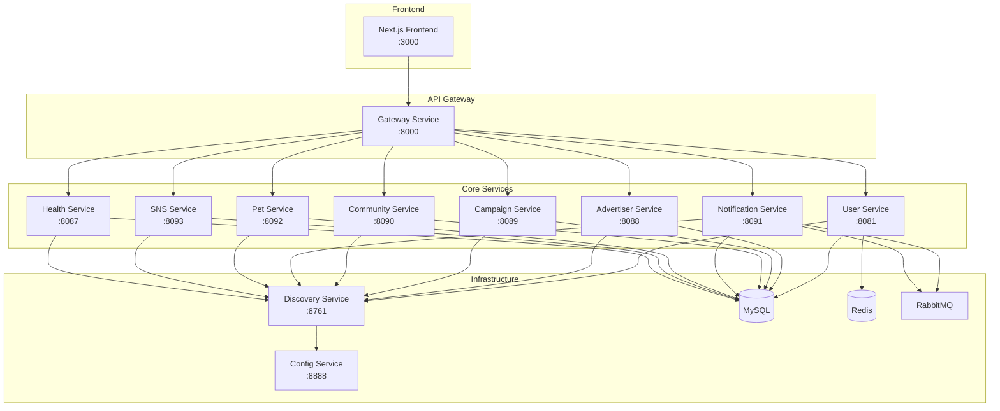

# PetFul
**펫 인플루언서와 광고주를 연결하는 반려동물 헬스케어 & 마케팅 통합 플랫폼**


### 📅 프로젝트 기간
**2025.07.18 ~ 2025.09.10**

## 📄 프로젝트 개요

**PetFul**은 **펫 인플루언서와 광고주를 연결하는 반려동물 헬스케어 & 마케팅 통합 플랫폼**입니다.  

- 🐾 **단일 회원가입 & 역할 기반 맞춤 기능**  
  인플루언서와 광고주가 동일한 환경에서 각자의 필요에 최적화된 경험을 제공합니다.  

- 💡 **다양한 기능 제공**  
  반려동물 건강 관리, 광고상품 매칭, 체험단 운영, 커뮤니티 교류 등 펫 생태계 전 과정을 아우릅니다.  

- 🤖 **최신 기술 접목**  
  AI 기반 추천, 벡터 검색, 자동화된 게시물 분석을 통해 **효율성과 신뢰성**을 극대화합니다.


### 🎯 주요 목표

- **MSA 아키텍처** 기반 서비스 구현 및 운영 경험
- **실제 서비스** 수준의 펫 인플루언서 플랫폼 개발
- **CI/CD 파이프라인** 구축 및 클라우드 배포 경험
- **AI 기술** 활용한 개인화 서비스 구현
---

## 👨‍💼 팀원 구성

| 이나영                                                           | 이지용                                                           | 임나연                                                          | 임현우                               | 정승원                              |
| ---------------------------------------------------------------- | ---------------------------------------------------------------- | --------------------------------------------------------------- | ------------------------------------ | ----------------------------------- |
|  |  |  |  |  |
| [GitHub](https://github.com/NYoungLEE)                           | [GitHub](https://github.com/gyongcode)                           | [GitHub](https://github.com/nyaeon)                             | [GitHub](https://github.com/LimHub)  | [GitHub](https://github.com/dkrio)  |
| **광고주/체험단 서비스**                                                | **SNS관리/서버구축/인프라구축**                                             | **건강관리 서비스**                                             | **알림/커뮤니티/관리자 서비스**      | **게이트웨이/유저 서비스/펫 서비스**          |

---

## 🏗️ MSA 아키텍처

### 📊 서비스 구성도



### 🔧 서비스별 역할

| 서비스명                 | 포트 | 담당자 | 주요 기능                              |
| ------------------------ | ---- | ------ | -------------------------------------- |
| **Gateway Service**      | 8080 | 정승원 | API Gateway, 라우팅, 인증, 로드밸런싱  |
| **User Service**         | 8081 | 정승원 | 회원가입/로그인, JWT 토큰인가, 마이페이지  |
| **Advertiser Service**   | 8088 | 이나영 | 광고주 관리, 광고 상품 등록/관리       |
| **Campaign Service**     | 8089 | 이나영 | 캠페인 관리, 체험단 운영, 매칭 시스템  |
| **Community Service**    | 8090 | 임현우 | 커뮤니티 기능, 게시글/댓글 관리        |
| **Notification Service** | 8091 | 임현우 | 알림 서비스, 푸시 알림, 이메일 발송    |
| **Pet Service**          | 8092 | 정승원 | 반려동물 관리, 펫스타 신청, 포트폴리오 |
| **SNS Service**          | 8093 | 이지용 | 인스타그램 연동, SNS 게시물 분석       |
| **Health Service**       | 8087 | 임나연 | 헬스체크, 모니터링, 건강 관리          |
| **Discovery Service**    | 8761 | 이지용 | Eureka 서버, 서비스 등록/발견          |
| **Config Service**       | 8888 | 이지용 | 공통 환경설정,repo파일로 설정 따로 관리            |
---
## 📚 문서

### 📋 프로젝트 문서

- [MSA 아키텍처 설계](https://www.notion.so/coffit23/MSA-215a02b1ffb1818d91fece9cc5192253)
- [인터페이스 설계서](http://docs.google.com/spreadsheets/d/1YJs2AJoIm8an-uj52x9yw4tmWIIbqlIaXEPFqDg0i3k/edit?usp=drive_web&ouid=102742334311949135580)
- [CI/CD 설계서](https://docs.google.com/document/d/1FNXlXXRqx7InF55VoobFvzX4uO8FSdpyaQAvSlmqYcU/edit?tab=t.0)

### 🎨 UI/UX 문서

- [화면설계서](https://docs.google.com/presentation/d/1ZxzSG5NaUtF59npgc8Cseuw0HTa3hKPu/edit?slide=id.p1#slide=id.p1)
- [UI 테스트 케이스](https://docs.google.com/spreadsheets/d/1vX94wemHoAR7O6h93lh7Zd6bb-6_KbPW/edit?gid=11049218#gid=11049218)

 ### 📖 상세 API 문서

- [API 명세서](https://docs.google.com/document/d/14EPMQJrLwLn31duQ4dwbm0mnjKOkFxLx/edit)

---
## 📌 기능 소개

<!-- 회원 / SNS / 관리자 -->
<table>
<tr>
<td valign="top" width="33%">

<h4>🔐 회원 관리</h4>

| 기능 |
|------|
| 이메일 기반 회원가입/로그인/비밀번호 재설정 |
| JWT 토큰 기반 인증 |
| 역할 기반 접근 제어 (펫 인플루언서/광고주) |
| 마이페이지 관리 |

</td>
<td valign="top" width="33%">

<h4>📱 SNS 연동</h4>

| 기능 |
|------|
| 인스타그램 계정 연동 |
| SNS 프로필 정보 수집 |
| 게시물 자동 분석 |
| 팔로워 수 및 참여도 추적 |

</td>
<td valign="top" width="33%">

<h4>👨‍💼 관리자 기능</h4>

| 기능 |
|------|
| 관리자 대시보드 |
| 펫스타 승인 관리 |
| 광고주 승인 관리 |
| 사용자 관리 |

</td>
</tr>
</table>


---

<!-- 반려동물 / 건강 -->
<table>
<tr>
<td valign="top" width="50%">

<h4>🐕 반려동물 관리</h4>

| 기능 |
|------|
| 반려동물 등록 및 프로필 관리 |
| 펫스타 신청 |
| 포트폴리오 관리 |
| 활동 이력 관리 |
| 이미지 업로드 및 관리 |

</td>
<td valign="top" width="50%">

<h4>🏥 건강 관리</h4>

| 기능 |
|------|
| 반려동물 건강 기록 관리 |
| 의료 기록 및 OCR 처방전 등록 |
| 예방접종 일정 관리 |
| 건강 캘린더 |
| 활동량 추적 |

</td>
</tr>
</table>

---

<!-- 광고주 / 캠페인 / 커뮤니티 / 알림 -->
<table>
<tr>
<td valign="top" width="25%">

<h4>📢 광고주 서비스</h4>

| 기능 |
|------|
| 광고주 회원가입 및 인증 |
| 광고 상품 등록 및 관리 |
| 펫스타 검색 및 필터링 |
| 캠페인 생성 및 관리 |
| 체험단 모집 및 운영 |

</td>
<td valign="top" width="25%">

<h4>🎯 캠페인 관리</h4>

| 기능 |
|------|
| 캠페인 생성 및 수정 |
| 펫스타 매칭 시스템 |
| 체험단 신청 및 관리 |
| 캠페인 진행 상황 추적 |
| 결과 보고서 생성 |

</td>
<td valign="top" width="25%">

<h4>💬 커뮤니티</h4>

| 기능 |
|------|
| 게시글 작성 및 관리 |
| 댓글 및 좋아요 기능 |
| 카테고리별 게시판 |
| 검색 및 필터링 |
| 신고 및 관리자 기능 |

</td>
<td valign="top" width="25%">

<h4>🔔 알림 서비스</h4>

| 기능 |
|------|
| 실시간 푸시 알림 |
| 이메일 알림 |
| 캠페인 관련 알림 |
| 커뮤니티 알림 |
| 알림 설정 관리 |

</td>
</tr>
</table>

---

## 🛠️ 기술 스택

<div align="center" style="max-width:500px; margin:auto;">

<table>
<tr>
<td valign="top" align="center">

<h4>🖥️ 프론트엔드</h4>

| 기술 | 버전 |
|------|------|
|  | 15 |
|  | 19 |
|  | ES6+ |
|  | 1.11.0 |

</td>
<td valign="top" align="center">

<h4>🔧 백엔드</h4>

| 기술 | 버전 |
|------|------|
|  | 17 |
|  | 3.5.4 |
|  | 2023.0.0 |
|  | 8.0 |
|  | 7 |
|  | 3.13 |

</td>
<td valign="top" align="center">

<h4>🚀 배포(DevOps)</h4>

| 기술 | 버전 |
|------|------|
|  | 24.0 |
|  | 2.426 |
|  | EC2·ECS |
|  | 8.4 |

</td>
<td valign="top" align="center">

<h4>🕸️ 크롤링</h4>

| 기술 | 버전 |
|------|------|
| 추가 예정 | 추가 예정 |

</td>
<td valign="top" align="center">

<h4>🤖 AI</h4>

| 기술 | 버전 |
|------|------|
| 추가 예정 | 추가 예정 |

</td>
</tr>
</table>

</div>


---

## 🚀 빠른 시작

### 📋 사전 요구사항

- Java 17+
- Docker & Docker Compose
- Node.js 18+
- MySQL 8.0+
- Redis 7+

### 🐳 Docker Compose로 실행

1. **저장소 클론**

```bash
git clone https://github.com/your-org/BE09-Final-3team-BE.git
cd BE09-Final-3team-BE
```

2. **환경 변수 설정**

```bash
# .env 파일 생성
cp .env.example .env
# 필요한 환경 변수 설정
```

3. **인프라 서비스 실행**

```bash
# Redis, RabbitMQ 실행
docker-compose up -d
```

4. **서비스 빌드 및 실행**

```bash
# 모든 서비스 빌드
./gradlew build

# 서비스별 실행 (순서 중요)
# 1. Config Service
cd config-service && ./gradlew bootRun

# 2. Discovery Service
cd discovery-service && ./gradlew bootRun

# 3. Gateway Service
cd gateway-service && ./gradlew bootRun

# 4. 기타 서비스들
cd user-service && ./gradlew bootRun
cd pet-service && ./gradlew bootRun
cd advertiser-service && ./gradlew bootRun
cd campaign-service && ./gradlew bootRun
cd community-service && ./gradlew bootRun
cd notification-service && ./gradlew bootRun
cd sns-service && ./gradlew bootRun
cd health-service && ./gradlew bootRun
```

### 🌐 접속 정보

- **Frontend**: http://localhost:3000
- **Gateway**: http://localhost:8000
- **Discovery Service**: http://localhost:8761
- **Config Service**: http://localhost:8888
- **RabbitMQ Management**: http://localhost:15672
- **Redis**: http://localhost:6379

---

## 📚 API 문서

### 🔗 주요 엔드포인트

#### 사용자 인증

```http
POST /auth/signup          # 회원가입
POST /auth/login           # 로그인
POST /auth/refresh         # 토큰 갱신
GET  /auth/profile         # 프로필 조회
PATCH /auth/profile        # 프로필 수정
```

#### 반려동물 관리

```http
POST /pets                 # 반려동물 등록
GET  /pets                 # 반려동물 목록 조회
GET  /pets/{id}            # 반려동물 상세 조회
PUT  /pets/{id}            # 반려동물 정보 수정
DELETE /pets/{id}          # 반려동물 삭제
POST /pets/{id}/portfolio  # 포트폴리오 등록
```

#### 광고주 서비스

```http
POST /advertisers/signup   # 광고주 회원가입
POST /advertisers/login    # 광고주 로그인
GET  /advertisers/products # 광고 상품 목록
POST /advertisers/products # 광고 상품 등록
PUT  /advertisers/products/{id} # 광고 상품 수정
```

#### 캠페인 관리

```http
GET  /campaigns            # 캠페인 목록 조회
POST /campaigns            # 캠페인 생성
GET  /campaigns/{id}       # 캠페인 상세 조회
PUT  /campaigns/{id}       # 캠페인 수정
POST /campaigns/{id}/apply # 캠페인 신청
```

#### SNS 연동

```http
POST /sns/instagram/connect # 인스타그램 연동
GET  /sns/instagram/profile # 인스타그램 프로필 조회
GET  /sns/instagram/media   # 인스타그램 게시물 조회
POST /sns/instagram/analyze # 게시물 분석
```

#### 커뮤니티

```http
GET  /community/posts      # 게시글 목록
POST /community/posts      # 게시글 작성
GET  /community/posts/{id} # 게시글 상세
POST /community/posts/{id}/comments # 댓글 작성
```

#### 알림 서비스

```http
GET  /notifications        # 알림 목록 조회
PUT  /notifications/{id}/read # 알림 읽음 처리
POST /notifications/subscribe # 알림 구독
```
---

## 🏗️ 아키텍처 상세

### 🔄 서비스 간 통신

- **동기 통신**: REST API (HTTP/HTTPS)
- **비동기 통신**: RabbitMQ (메시지 큐)
- **서비스 발견**: Eureka Server
- **설정 관리**: Spring Cloud Config
- **서비스 간 호출**: OpenFeign

### 🔐 보안 아키텍처

- **인증**: JWT 토큰 기반
- **인가**: Spring Security + Role-based
- **API Gateway**: 중앙 집중식 인증/인가
- **CORS**: 프론트엔드 도메인 허용

### 📊 데이터 흐름

1. **사용자 등록** → User Service
2. **반려동물 등록** → Pet Service
3. **SNS 연동** → SNS Service
4. **캠페인 생성** → Campaign Service
5. **매칭 시스템** → 추천 알고리즘
6. **알림 발송** → Notification Service

---

### 📊 테스트 커버리지

- [테스트 결과서](https://www.notion.so/coffit23/25ca02b1ffb18145ad60e86ee9e94fa4)
- [테스트 케이스](https://www.notion.so/coffit23/266a02b1ffb180efa6e1e35158323fe8)

---

## 🚀 배포

### 🐳 Docker 배포

```bash
# 이미지 빌드
docker build -t petful-gateway ./gateway-service
docker build -t petful-user ./user-service
docker build -t petful-pet ./pet-service
# ... 기타 서비스들

# 컨테이너 실행
docker run -d -p 8080:8080 petful-gateway
```

### ☁️ AWS 배포

- **EC2**: 서비스 호스팅
- **ECS**: 컨테이너 오케스트레이션
- **RDS**: MySQL 데이터베이스
- **ElastiCache**: Redis 캐시
- **SES**: 이메일 발송

### 🔄 CI/CD 파이프라인

```yaml
# Jenkinsfile 예시
pipeline {
agent any
stages {
stage('Build') {
steps {
sh './gradlew build'
}
}
stage('Test') {
steps {
sh './gradlew test'
}
}
stage('Docker Build') {
steps {
sh 'docker build -t petful .'
}
}
stage('Deploy') {
steps {
sh 'docker push petful:latest'
}
}
}
}
```
---

## 📝 회고

### 👩‍💻 이나영 (광고주/체험단 서비스)

> **주요 역할**: 광고주 서비스, 캠페인 관리, 광고 상품 등록/관리  
> **느낀 점**: 
### 👨‍💻 이지용 (SNS관리/서버구축)

> **주요 역할**: SNS 연동, 인스타그램 API 연동, 서버 인프라 구축 , MSA 인프라 구축  
> **느낀 점**: 

### 👩‍💻 임나연 (건강관리 서비스)

> **주요 역할**: 헬스 서비스  
> **느낀 점**: 반려동물의 건강 정보를 체계적으로 관리하는 시스템을 구현하면서 도메인 주도 설계(DDD)의 중요성을 깨달았습니다. 사용자 중심의 UI/UX 설계와 데이터 모델링에 많은 노력을 기울였습니다.

### 👨‍💻 임현우 (알림/커뮤니티/관리자 서비스)

> **주요 역할**: 알림 서비스, 커뮤니티 기능, 관리자 대시보드  
> **느낀 점**: 

### 👨‍💻 정승원 (게이트웨이/유저 서비스/펫 서비스)

> **주요 역할**: API Gateway, 유저 서비스, JWT 토큰 구축, 펫 서비스, 파일서버 연동

> **느낀 점**  
> MSA 아키텍처에서 중요한 역할을 하는 **게이트웨이**를 직접 구축하면서 **보안**의 중요성을 깊이 체감할 수 있었다.  
> 특히 **JWT 기반 인증·인가**를 처음 적용하다 보니 초반에는 로직 이해에 어려움이 있었지만,  
> 시행착오를 거치면서 점차 구조를 익히고 문제를 해결할 수 있었다.  
>
> 초기에는 막막함과 부담감이 컸지만, 오류를 하나씩 고쳐 나가면서 경험이 쌓였고,  
> 다른 서비스와 **토큰 인가**가 연결될 때 발생하는 영향까지 고려하는 사고를 배울 수 있었다.  
>
> 해결 과정에서는 웹 서핑과 이전 프로젝트 코드 분석을 통해 차이점을 파악하고 적용했으며,  
> 팀원들의 꾸준한 피드백이 큰 도움이 되었다. 또한 **파일 서버 연동**을 통해 단순히 파일을 업로드하는 것을 넘어  
> **DB와 직접 연결해 URL 기반으로 관리·표시**하는 방식을 구현하면서 많은 배움을 얻을 수 있었다.  
>
> **이메일 발송 기능** 구현 과정에서는 **Redis**를 **Docker** 환경에 적용하는 방법을 다시 학습했고,  
> **구글 오픈 키**를 이용해 실제로 이메일 발송 기능을 완성했을 때 뿌듯함을 느꼈다.  
>
> 이번 부트캠프 마지막 프로젝트를 통해 다양한 기술을 직접 경험하며 단순 구현을 넘어  
> **보안·인프라·데이터 처리 전반의 실무 감각**을 익힐 수 있었다.  
> 앞으로도 이번에 익힌 다양한 **스킬**들을 토대로 실무 환경에서 적극적으로 적용하고 성장해 나가고 싶다.  


---

<div align="center">

**🐕 PetFul과 함께 펫 인플루언서의 새로운 경험을 시작하세요! 🐕**


</div>
